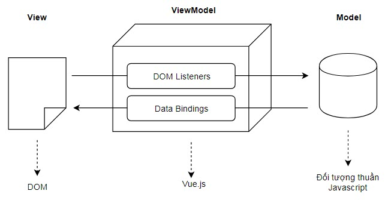

# 1. Giới thiệu
## 1.1 Vue.js là gì?
Gọi tắt là Vue (phát âm là /vjuː/, giống như view trong tiếng Anh), Vue.js là một framework linh động (nguyên bản tiếng Anh: progressive – tiệm tiến) dùng để xây dựng giao diện người dùng (user interfaces). Khác với các framework nguyên khối (monolithic), Vue được thiết kế từ đầu theo hướng cho phép và khuyến khích việc phát triển ứng dụng theo từng bước. Khi phát triển lớp giao diện (view layer), người dùng chỉ cần dùng thư viện lõi (core library) của Vue, vốn rất dễ học và tích hợp với các thư viện hoặc dự án có sẵn. Cùng lúc đó, nếu kết hợp với những kĩ thuật hiện đại như SFC (single file components) và các thư viện hỗ trợ, Vue cũng đáp ứng được dễ dàng nhu cầu xây dựng những ứng dụng một trang (SPA - Single-Page Applications) với độ phức tạp cao hơn nhiều.

Vue.js được sử dụng để xây dựng giao diện người dùng giống như React (sử dụng bởi Facebook), Angular (được hậu thuẫn bởi Google), Ember… Tuy nhiên, Vue.js có tốc độ tạo trang (render) rất nhanh và chiếm khá ít bộ nhớ. Chúng ta có thể xem bảng benchmark các framework Javascript nổi tiếng nhất hiện nay, Vue có một thứ hạng không tồi chút nào.
## 2.1 Mô hình VueJs áp dụng
MVVM là viết tắt của `Model-View-ViewModel` là một mô hình được áp dụng trong framework Vue.js.

<p align = "center">

</p>

Trong mô hình này, dữ liệu mỗi khi được "gán" vào View hoặc Model sẽ đều được Vue.js tự động gắn cho phần còn lại. Tức là khi dữ liệu thay đổi ở Model nó sẽ tự động được "cập nhật" sang View và khi người dùng thay đổi dữ liệu trên View (ví dụ nhập liệu vào ô địa chỉ email chẳng hạn) thì dữ liệu cũng được tự động cập nhật ngược lại Model. Trong cộng đồng Vue.js thường gọi mô hình này với một thuật ngữ khác là two-way data binding, tạm gọi là gán dữ liệu hai chiều. Chúng ta sẽ cùng tìm hiểu mô hình này trong ví dụ đầu tiên sử dụng Vue.js ở phần tiếp theo.

# 2. Sử dụng Vuejs
## 2.1 Visual Studio Code 
- Cài đặt NPM :

    ```vuejs
        npm install -g @vue/cli
    ```
- Tạo ứng dụng đầu tiên :

    ```vuejs
        vue create my-app
        cd my-app
        npm run serve
    ```
Và bây giờ ứng dụng của bạn đã chạy ở port 8080,truy cập vào http://localhost:8080 bạn có thể thấy "Welcome to your Vue.js App"

<p align = "center">

</p>

## 2.2 Gợi ý một số extension 
-   Vetur extension Vetur : hỗ trợ Syntax-highlighting Snippet Linting / Error Checking Formatting Auto Completion Debugging
- Vue VSCode Snippets
- Import Cost
- Color Info - Todo Highlighter
- Path Intellisense